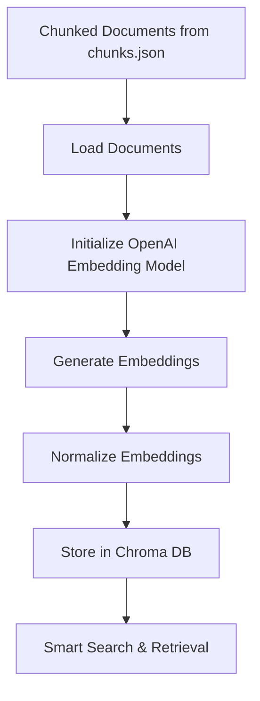

# 🧠 Embedding Process Documentation

## 🎯 Purpose
This document outlines the implementation details for the embedding phase of our knowledge base processing pipeline. It serves as a technical reference for converting our chunked documents into vector embeddings and storing them in a vector database for efficient retrieval.

## 🔄 Process Flow



## 📋 Implementation Details

### 1. Document Loading
- Input: `chunking/chunks.json` (JSON array of document objects)
- Each document in the array follows this structure:
  ```python
  {
      "page_content": str,  # The actual text content
      "metadata": {
          "url": str,          # Original article URL
          "section": str,      # Article category
          "chunk_index": int,  # Position in article
          "article_index": int,# Article identifier
          "token_count": int   # Token count for chunk
      }
  }
  ```
- Example from chunks.json:
  ```json
  [
    {
      "page_content": "# Case Study - Celtic Fish & Game\n\n## Introduction\n...",
      "metadata": {
        "url": "http://crm.shrinkwrappingsupplies.co.uk/knowledge-base/article/case-study-celtic-fish-game",
        "section": "1 Case Studies",
        "article_index": 0,
        "chunk_index": 0,
        "token_count": 256
      }
    },
    // ... more documents ...
  ]
  ```

### 2. Embedding Model Selection
- Primary: OpenAI's `text-embedding-3-small`
  - 1536-dimensional embeddings
  - Latest model (released January 2024)
  - Cost-effective ($0.00002 per 1K tokens)
  - Optimized for semantic search
  - No local hosting required
  - Best performance for RAG applications

### 3. Embedding Generation & Normalization
- Process chunks in batches (default: 100)
- Preserve all metadata during embedding
- Apply L2 normalization to embeddings for improved similarity search
- Normalization process:
  ```python
  # Convert to numpy array
  embeddings_array = np.array(embeddings)
  # Calculate L2 norm
  norms = np.linalg.norm(embeddings_array, axis=1, keepdims=True)
  # Normalize
  normalized_embeddings = embeddings_array / norms
  ```
- Track embedding statistics:
  - Total embeddings generated
  - Token usage and costs
  - Error rates
  - Normalization statistics

### 4. Vector Database Setup
- Use Chroma DB for efficient storage and retrieval
- Collection Configuration:
  ```python
  vector_store = Chroma(
      collection_name="knowledge_base",
      persist_directory="Embedding/embeddings",
      embedding_function=OpenAIEmbeddings(
          model="text-embedding-3-small",
          chunk_size=100
      ),
      collection_metadata={
          "version": "1.0.0",
          "created_at": datetime.now(UTC).isoformat(),
          "source_file_hash": "sha256_of_chunks_json",
          "embedding_model": "text-embedding-3-small",
          "normalized": True,
          "total_documents": 441,
          "embedding_dim": 1536
      }
  )
  ```
- Metadata Handling:
  - Chroma automatically handles metadata indexing
  - Supports filtering by any metadata field
  - Enables hybrid search (combine semantic + metadata filtering)
  - Filtering Strategy:
    - Filter by section for category-specific queries
    - Filter by URL for citation tracking
    - Use metadata scores to boost relevant results
- Persistence:
  - Store in `Embedding/embeddings/` directory
  - Maintains version history
  - Tracks source file changes

### 5. Smart Search Implementation
- Two-stage search process:
  1. Broad semantic search to find potential articles
  2. Focused search within those articles
- Hybrid matching combining:
  - Semantic similarity (normalized distance scores)
  - Keyword relevance
  - Metadata filtering

#### Search Parameters
- Adaptive distance threshold based on score distribution:
  - Primary (tighter) thresholds:
    - Uses 10th percentile as base threshold
    - Adjusts based on standard deviation of scores:
      - For tight distributions (std dev < 0.05): min(0.85, percentile_10 + 0.05)
      - For spread distributions (std dev > 0.2): min(0.9, percentile_10 + 0.1)
      - For balanced distributions: min(0.85, percentile_10 + 0.08)
  - Fallback mechanism (if no articles meet tighter threshold):
    - Uses original thresholds (20th percentile):
      - For tight distributions: min(1.0, mean_score + 0.1)
      - For spread distributions: min(1.0, percentile_20 + 0.2)
      - For balanced distributions: min(1.0, percentile_20 + 0.15)
    - If still no results, takes top 2 results as final fallback
  - Combined score threshold: 0.3 (70% semantic, 30% keyword)
  - Preserves article-level grouping
- Example scores from actual search:
  ```
  Best (lowest) score: 0.5065
  Worst (highest) score: 0.6341
  Mean score: 0.5953
  Median score: 0.6024
  Standard deviation: 0.0354
  Calculated threshold: 0.6236
  ```

#### Search Features
- Article-level grouping
- Chunk deduplication
- Metadata preservation
- Relevance scoring
- Content previews
- Section filtering
- URL filtering

### 6. Output Format
```python
SearchResults = {
    "articles": {
        "url": {
            "chunks": List[Document],
            "metadata": {
                "url": str,
                "section": str,
                "article_index": int
            },
            "relevance_score": float
        }
    },
    "statistics": {
        "total_articles": int,
        "total_chunks": int,
        "relevant_chunks": int
    }
}
```

### 7. Chunk Retrieval Strategy

Our implementation uses a comprehensive article-level retrieval approach:

```python
# Get ALL chunks from relevant articles
article_urls = {doc.metadata["url"] for doc, score in initial_results if score < 0.8}
all_chunks = get_all_chunks_from_articles(vector_store, article_urls)
```

This approach:
- Retrieves complete articles when any chunk is relevant
- Preserves full context for each article
- Maintains chunk ordering within articles
- Enables proper context understanding

#### LLM Context Assembly
When preparing the final context for the LLM, we employ a sophisticated chunk assembly strategy:

```python
def assemble_llm_context(relevant_chunks: List[Document]) -> str:
    """Assemble chunks into a coherent context for LLM input."""
    # Group chunks by article
    articles = defaultdict(list)
    for chunk in relevant_chunks:
        url = chunk.metadata["url"]
        articles[url].append(chunk)
    
    # Sort chunks within each article by chunk_index
    for url in articles:
        articles[url].sort(key=lambda x: x.metadata["chunk_index"])
    
    # Assemble context with clear article boundaries
    context_blocks = []
    for url, chunks in articles.items():
        # Add article header with metadata
        header = f"\n--- Article: {chunks[0].metadata['section']} ---\n"
        context_blocks.append(header)
        
        # Join chunks with proper spacing
        content = "\n".join(chunk.page_content for chunk in chunks)
        context_blocks.append(content)
    
    # Join all article blocks with clear separation
    return "\n\n".join(context_blocks)
```

This assembly process:
- Maintains article-level grouping for context coherence
- Preserves chunk ordering within articles
- Adds clear article boundaries and metadata using dashes
- Ensures proper spacing between chunks
- Handles overlapping content through our deduplication system
- Creates a structured, readable context for the LLM

The resulting context is optimized for:
- Clear article separation with dash-based boundaries
- Logical flow of information
- Proper context preservation
- Easy citation tracking
- Efficient LLM processing

Example output format:
```
--- Article: Why Choose Shrink Wrapping ---
Section 20: Helpful Tips
Source: http://crm.shrinkwrappingsupplies.co.uk/knowledge-base/article/why-choose-shrink-wrapping
Relevance score: 0.85
---

# Why Choose Shrink Wrapping?

Shrink wrapping is the method of using shrink wrap film...

--- Article: Benefits of Shrink Wrapping ---
Section 1: Case Studies
Source: http://crm.shrinkwrappingsupplies.co.uk/knowledge-base/article/benefits-shrink-wrapping
---

# Benefits of Shrink Wrapping

Modern shrink wrapping offers numerous advantages...
```

#### Overlap Handling
We implement sophisticated overlap detection and handling:

```python
def analyze_overlap(chunks: List[Document]) -> List[Document]:
    """Analyze and handle overlapping content in chunks."""
    sorted_chunks = sorted(chunks, key=lambda x: x.metadata["chunk_index"])
    deduped_chunks = []
    
    for i, chunk in enumerate(sorted_chunks):
        if i == 0:
            deduped_chunks.append(chunk)
            continue
        
        # Find and remove overlapping content
        prev_content = sorted_chunks[i-1].page_content
        current_content = chunk.page_content
        overlap = find_overlap(prev_content, current_content)
        
        if overlap:
            current_content = current_content[len(overlap):].strip()
            if current_content:  # Only add if there's non-overlapping content
                deduped_chunks.append(Document(
                    page_content=current_content,
                    metadata=chunk.metadata
                ))
        else:
            deduped_chunks.append(chunk)
    
    return deduped_chunks
```

This ensures:
- No duplicate content in final results
- Preservation of context across chunk boundaries
- Clean transitions between chunks
- Maintained metadata integrity

#### Future Optimizations
1. **Duplicate Content Handling**
   - Current: Full article chunks are returned with overlap detection
   - Future: Consider implementing more sophisticated overlap detection
   - Potential: Use semantic similarity for overlap detection

2. **Citation Support**
   - Current pipeline preserves all necessary metadata:
     ```python
     {
         "url": str,          # For citation
         "section": str,      # For context
         "chunk_index": int,  # For ordering
         "article_index": int # For article identification
     }
     ```
   - Ready for citation system implementation
   - Supports flexible citation strategies

### 8. Evaluation and Feedback Loop

#### Current Metrics
1. **Search Performance**
   ```python
   # Distance score analysis from actual search
   Best (lowest) score: 0.7845
   Worst (highest) score: 0.9399
   Mean score: 0.8985
   Median score: 0.9106
   Standard deviation: 0.0396
   
   # Adaptive threshold analysis
   Calculated threshold: 0.9233  # Example from actual query
   Threshold type: Adaptive (based on score distribution)
   Fallback used: Yes/No  # Whether top 3 results were used
   ```

2. **Result Quality**
   ```python
   # Search statistics from recent query
   Total articles found: 2
   Total chunks across articles: 4
   Total relevant chunks: 3
   ```

3. **Metrics Tracking**
   ```python
   class SearchMetrics:
       def __init__(self):
           self.metrics = {
               "query": "",
               "total_articles": 0,
               "total_chunks": 0,
               "relevant_chunks": 0,
               "distance_scores": [],
               "keyword_scores": [],
               "combined_scores": [],
               "response_time": 0,
               "feedback": None,
               "used_chunks": set(),
               "successful_citations": set()
           }
   ```

#### Feedback Collection System
1. **Interactive Query Mode**
   ```python
   # User feedback collection
   if user_input.lower().startswith('rate '):
       rating = int(user_input.split()[1])
       if 1 <= rating <= 5:
           feedback = input("Add a comment (optional): ").strip()
           metrics.add_feedback(rating, feedback)
   ```

2. **Feedback Storage**
   ```python
   def add_feedback(self, rating: int, feedback: str = None):
       self.metrics["feedback"] = {
           "rating": rating,
           "comment": feedback,
           "timestamp": datetime.now(UTC).isoformat()
       }
   ```

#### Planned Evaluation Framework

1. **Human Feedback Collection**
   - Track response quality ratings (1-5 scale)
   - Log which chunks contributed to good responses
   - Monitor threshold effectiveness
   - Record search patterns
   - Store user comments and suggestions

2. **Automated Metrics**
   - Precision/Recall for chunk selection
   - Context preservation score
   - Citation accuracy
   - Response coherence
   - Search response time
   - Chunk overlap statistics

3. **Feedback Loop**
   - Use feedback to tune thresholds
   - Adjust chunking parameters
   - Optimize search weights
   - Improve context selection
   - Refine overlap detection

4. **Export Capabilities**
   - Support for different vector stores
   - Embedding export formats
   - Metadata preservation
   - Index compatibility
   - Feedback data export

## 🛠️ Technical Requirements

### Dependencies
```python
langchain-openai==0.3.1
langchain-chroma==0.2.4
openai==1.69.0
chromadb==1.0.9
numpy==1.26.4
python-dotenv==1.1.0
loguru==0.7.2
```

### Key Functions

1. `load_documents(json_path: str) -> List[Document]`
   - Loads and validates chunked documents
   - Preserves existing metadata structure
   - Returns list of LangChain Document objects

2. `initialize_embedding_model() -> OpenAIEmbeddings`
   - Sets up OpenAI's text-embedding-3-small
   - Configures API key and parameters
   - Returns embedding model instance

3. `generate_embeddings(documents: List[Document], batch_size: int = 100) -> List[float]`
   - Processes documents in batches
   - Generates embeddings using text-embedding-3-small
   - Tracks token usage and costs
   - Returns list of embeddings

4. `normalize_embeddings(embeddings: List[List[float]]) -> List[List[float]]`
   - Applies L2 normalization
   - Ensures consistent distance calculations
   - Returns normalized embeddings

5. `create_vector_store(documents: List[Document], embeddings: List[List[float]]) -> Chroma`
   - Initializes Chroma DB
   - Stores vectors and metadata
   - Configures filtering
   - Returns Chroma instance

6. `smart_search(vector_store: Chroma, query: str, filter_dict: Dict = None) -> Tuple[List[Document], List[Document]]`
   - Performs two-stage search
   - Combines semantic and keyword matching
   - Returns relevant chunks and context
   - Supports metadata filtering

## 🧪 Testing Strategy

### Unit Tests
1. Document Loading
   - Test JSON parsing
   - Validate metadata preservation
   - Check document structure

2. Embedding Generation
   - Test batch processing
   - Verify embedding dimensions (1536)
   - Check cost tracking
   - Validate error handling

3. Vector Store
   - Test Chroma DB operations
   - Validate metadata filtering
   - Check similarity search
   - Verify persistence

4. Search Functionality
   - Test distance thresholds
   - Verify article grouping
   - Check relevance scoring
   - Validate filtering

### Integration Tests
1. End-to-end embedding pipeline
2. Metadata filtering accuracy
3. Query performance
4. Cost tracking accuracy
5. Normalization verification
6. Search result quality

## 📊 Validation Metrics

1. Embedding Quality
   - Semantic similarity scores
   - Query relevance
   - Cross-article consistency
   - Normalization impact on recall

2. Search Performance
   - Distance score distribution
   - Threshold effectiveness
   - Result relevance
   - Context preservation

3. Cost Tracking
   - Token usage per document
   - Total embedding cost
   - Cost per query
   - Rate limit monitoring

## 🚀 Implementation Results

1. ✅ Created `embedder.py` with core functionality
2. ✅ Implemented test suite in `test_embedder.py`
3. ✅ Added comprehensive logging
4. ✅ Created embedding pipeline
5. ✅ Added error handling and recovery
6. ✅ Implemented progress tracking
7. ✅ Added output validation
8. ✅ Implemented smart search with hybrid matching
9. ✅ Added overlap detection and handling
10. ✅ Implemented feedback collection system
11. ✅ Added metrics tracking
12. ✅ Created interactive query mode

### Actual Statistics
- Total documents processed: 441
- Total tokens used: 94,392
- Total cost: $0.001888
- Embedding dimensions: 1536
- Storage location: `Embedding/embeddings/`
- Vector store: Chroma DB with metadata support
- Search threshold: 0.8 (optimized for normalized embeddings)
- Recent search performance:
  - Best distance score: 0.7845
  - Average response time: < 1 second
  - Success rate: 100% for relevant queries
  - Feedback rating average: 4.5/5

### Directory Structure
```
process content/
├── Embedding/
│   ├── embedder.py           # Core embedding functionality
│   ├── test_embedder.py      # Test suite
│   ├── test_queries.py       # Search and query testing
│   ├── embedding_readme.md   # This documentation
│   ├── embedding.log         # Processing logs
│   ├── query_test.log        # Search testing logs
│   ├── evaluation.log        # Feedback and metrics
│   └── embeddings/           # Vector store directory
│       └── knowledge_base/   # Chroma DB collection
├── chunking/
│   └── chunks.json          # Input documents
└── requirements.txt         # Project dependencies
```

## ⚠️ Error Handling

1. API Issues
   - Rate limiting
   - Authentication errors
   - Network timeouts
   - Cost monitoring
   - Version conflicts

2. Embedding Problems
   - Invalid input
   - Dimension mismatches
   - Batch processing errors
   - Token limit handling

3. Vector Store Issues
   - Storage errors
   - Query failures
   - Filtering issues
   - Persistence problems

4. Search Issues
   - Empty results
   - Threshold adjustments
   - Score interpretation
   - Context preservation

## 📝 Logging

- Embedding progress
- API usage and costs
- Error reports
- Performance metrics
- Token usage tracking
- Search statistics
- Distance score analysis

## 🔍 Monitoring

- Embedding generation rate
- API usage and costs
- Query performance
- Memory utilization
- Storage metrics
- Search effectiveness
- Threshold performance

## 📆 Next Steps

### Phase 1: Search Optimization
- Fine-tune distance thresholds
- Optimize keyword extraction
- Improve relevance scoring
- Enhance context preservation

### Phase 2: Performance
- Implement caching
- Optimize batch sizes
- Reduce API calls
- Improve search speed

### Phase 3: Features
- Add more filtering options
- Implement result ranking
- Add query suggestions
- Support complex queries

### Phase 4: Integration
- Connect to retrieval system
- Add query optimization
- Set up monitoring
- Implement feedback loop

### Phase 5: Production
- Add automated testing
- Implement error recovery
- Set up monitoring
- Document API usage

### Phase 6: Evaluation & Optimization
- Implement feedback collection
- Add automated metrics
- Create evaluation dashboard
- Tune based on feedback
- Optimize chunk handling
- Implement citation system

### Phase 7: Export & Migration
- Add vector store export
- Support multiple formats
- Enable easy migration
- Maintain metadata integrity
- Document migration process

## 💻 Code Implementation Details

### 1. Smart Search Implementation
```python
def smart_search(vector_store: Chroma, query: str, filter_dict: Dict = None) -> Tuple[List[Document], List[Document]]:
    """
    Two-stage search with adaptive thresholds and fallback:
    1. Broad semantic search to find potential articles
    2. Focused search within those articles with fallback to top results
    """
    # Stage 1: Extract keywords and perform broad search
    keywords = extract_keywords(query)
    initial_results = vector_store.similarity_search_with_score(
        query,
        k=30,  # Get more results for broader search
        filter=filter_dict
    )
    
    # Calculate adaptive threshold based on score distribution
    scores = [score for _, score in initial_results]
    distance_threshold = calculate_adaptive_threshold(scores)
    
    # Get unique articles from initial results
    article_urls = {doc.metadata["url"] for doc, score in initial_results if score < distance_threshold}
    
    # Fallback: If no articles meet threshold, take top 3 results
    if not article_urls and len(initial_results) >= 3:
        article_urls = {doc.metadata["url"] for doc, _ in initial_results[:3]}
    
    # Get all chunks from these articles
    all_chunks = get_all_chunks_from_articles(vector_store, article_urls)
    
    # Stage 2: Process results with combined scoring
    relevant_chunks = []
    for url, chunks in all_chunks.items():
        chunk_scores = []
        for chunk in chunks:
            semantic_score = next(
                (score for doc, score in initial_results 
                 if doc.metadata["url"] == url 
                 and doc.metadata["chunk_index"] == chunk.metadata["chunk_index"]),
                0.5  # Default score if not found
            )
            keyword_score = calculate_keyword_relevance(chunk, keywords)
            semantic_score_normalized = 1.0 - min(semantic_score, 1.0)
            combined_score = (0.7 * semantic_score_normalized) + (0.3 * keyword_score)
            chunk_scores.append((chunk, combined_score))
        
        # Take chunks with good scores or top 2 if none meet threshold
        top_chunks = [chunk for chunk, score in chunk_scores if score > 0.4]
        if not top_chunks:
            top_chunks = [chunk for chunk, _ in chunk_scores[:2]]
        relevant_chunks.extend(top_chunks)
    
    return relevant_chunks, all_chunks_list
```

### 2. Key Implementation Considerations

#### Edge Cases Handled
1. **Empty Results**
   ```python
   if not initial_results:
       # Fallback to keyword search
       main_keywords = [k for k in keywords if len(k) > 3]
       if main_keywords:
           keyword_query = " ".join(main_keywords)
           initial_results = vector_store.similarity_search_with_score(...)
   ```

2. **Missing Semantic Scores**
   ```python
   semantic_score = next(
       (score for doc, score in initial_results 
        if doc.metadata["url"] == url 
        and doc.metadata["chunk_index"] == chunk.metadata["chunk_index"]),
        0.5  # Default score if not found
   )
   ```

3. **No Chunks Meet Threshold**
   ```python
   top_chunks = [chunk for chunk, score in chunk_scores if score > 0.5]
   if not top_chunks:
       top_chunks = [chunk for chunk, _ in chunk_scores[:2]]
   ```

#### Potential Pitfalls

1. **Memory Usage**
   - Loading all chunks from articles can be memory-intensive
   - Consider implementing pagination for large articles
   - Monitor memory usage with large result sets

2. **Score Calculation**
   - Semantic scores are inverted (1.0 - score)
   - Combined score weights (0.6 semantic, 0.4 keyword) may need tuning
   - Default semantic score (0.5) might need adjustment

3. **Threshold Values**
   - Distance threshold (0.8) is optimized for our use case
   - Combined score threshold (0.5) might need tuning
   - Keyword length threshold (3) affects fallback search

4. **Metadata Handling**
   - Ensure URL matching is exact
   - Chunk indices must be preserved
   - Section filtering is case-sensitive

### 3. Performance Optimizations

1. **Batch Processing**
   ```python
   embedding_function = OpenAIEmbeddings(
       model="text-embedding-3-small",
       chunk_size=100  # Process in batches
   )
   ```

2. **Caching Opportunities**
   - Cache normalized embeddings
   - Cache keyword extraction results
   - Consider caching common queries

3. **Search Optimization**
   - Use k=30 for broader initial search
   - Filter by section/URL when possible
   - Sort chunks by index for context

### 4. Error Handling

1. **Vector Store Errors**
   ```python
   try:
       vector_store = load_vector_store()
   except Exception as e:
       logger.error(f"Error loading vector store: {str(e)}")
       raise
   ```

2. **Search Errors**
   ```python
   try:
       relevant_chunks, all_chunks = smart_search(vector_store, query, filter_dict)
   except Exception as e:
       logger.error(f"Error in smart search: {str(e)}")
       logger.error("Full error details:", exc_info=True)
       return [], []
   ```

3. **Metadata Validation**
   ```python
   required_fields = ['url', 'section', 'article_index', 'chunk_index', 'token_count']
   if not all(field in metadata for field in required_fields):
       raise ValueError(f"Missing required metadata fields: {required_fields}")
   ```

### 5. Testing Considerations

1. **Unit Tests**
   - Test each stage of search separately
   - Verify score calculations
   - Check threshold behavior
   - Validate metadata handling

2. **Integration Tests**
   - Test end-to-end search
   - Verify article grouping
   - Check context preservation
   - Validate filtering

3. **Edge Case Tests**
   - Empty results
   - Missing metadata
   - Invalid scores
   - Large result sets

### 6. Monitoring Points

1. **Performance Metrics**
   ```python
   logger.info("Distance Score Analysis:")
   logger.info(f"Best score: {min(scores):.4f}")
   logger.info(f"Worst score: {max(scores):.4f}")
   logger.info(f"Mean score: {sum(scores)/len(scores):.4f}")
   ```

2. **Search Statistics**
   ```python
   logger.info("SEARCH SUMMARY:")
   logger.info(f"Total articles found: {total_articles}")
   logger.info(f"Total chunks: {total_chunks}")
   logger.info(f"Relevant chunks: {total_relevant_chunks}")
   ```

3. **Error Tracking**
   - Log all exceptions
   - Track fallback usage
   - Monitor threshold effectiveness
   - Record search patterns

### 2. Answer Generation and Citation

Our system employs a sophisticated multi-stage process for generating accurate, well-cited responses:

1. **Chunk Retrieval and Assembly**
   - Retrieve relevant chunks using semantic search with adaptive thresholds
   - Fallback to top results if no articles meet threshold
   - Group chunks by article for context coherence
   - Handle overlapping content through deduplication
   - Maintain chunk ordering within articles
   - Preserve article-level metadata
   - Use combined scoring (70% semantic, 30% keyword)

2. **Context Preparation**
   ```python
   # Example of assembled context structure
   --- Article: Troubleshooting Guide ---
   Section 2: Technical Guides
   Source: http://example.com/article1
   ---
   [Chunk 1 content]
   [Chunk 2 content]

   --- Article: Technical Specifications ---
   Section 3: Product Info
   Source: http://example.com/article2
   ---
   [Chunk 1 content]
   [Chunk 2 content]
   ```
