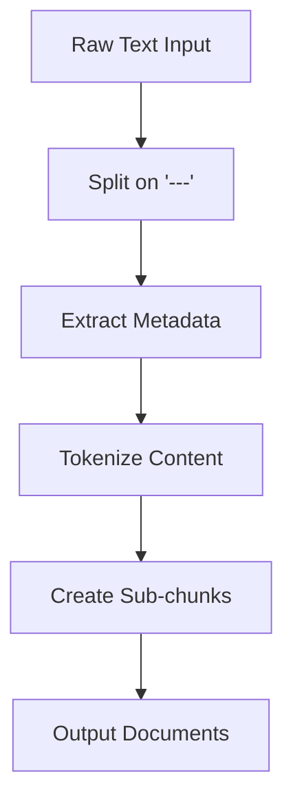

# 📑 Chunking Process Documentation

## 🎯 Purpose
This document outlines the implementation details for the chunking phase of our knowledge base processing pipeline. It serves as a technical reference for the chunking process and its components.

## 🔄 Process Flow



## 📋 Implementation Details

### 1. Raw Text Processing
- Input: `knowledge_base_llms.txt`
- Split articles using `---` delimiter
- Handle edge cases:
  - Empty articles
  - Malformed delimiters
  - Articles without metadata

### 2. Metadata Extraction
- Parse from markdown-style headers:
  ```markdown
  > **URL:** <http://example.com/article>
  > **Section:** Category Name
  ```
- Store in structured format:
  ```python
  metadata = {
      "url": str,
      "section": str,
      "article_index": int
  }
  ```

### 3. Tokenization
- Use `tiktoken` for accurate token counting
- Preserve markdown formatting
- Track token counts per article
- Generate statistics:
  - Mean tokens per article
  - Median tokens
  - Min/Max tokens
  - Standard deviation

### 4. Sub-chunking Strategy
- Target chunk size: 256 tokens
- Overlap: 64 tokens
- Rules:
  - Never split mid-sentence
  - Preserve markdown headers
  - Maintain paragraph integrity
  - Handle edge cases:
    - Articles < 256 tokens (keep as single chunk)
    - Articles with complex formatting
    - Articles with code blocks

### 5. Output Format
```python
Document = {
    "page_content": str,  # The chunk content
    "metadata": {
        "url": str,
        "section": str,
        "chunk_index": int,
        "article_index": int,
        "token_count": int
    }
}
```

## 🛠️ Technical Requirements

### Dependencies
```python
tiktoken==0.5.1  # For accurate token counting
markdown==3.5.1  # For markdown parsing
pydantic==2.5.2  # For data validation
```

### Key Functions

1. `split_articles(raw_text: str) -> List[str]`
   - Splits input on '---'
   - Validates article format
   - Returns list of articles

2. `extract_metadata(article: str) -> Dict[str, str]`
   - Parses URL and section
   - Validates metadata format
   - Returns metadata dictionary

3. `tokenize_content(content: str) -> int`
   - Counts tokens using tiktoken
   - Preserves markdown
   - Returns token count

4. `create_chunks(article: str, metadata: Dict) -> List[Document]`
   - Creates 256-token chunks with 64-token overlap
   - Preserves formatting
   - Returns list of Document objects

## 🧪 Testing Strategy

### Unit Tests
1. Article Splitting
   - Test correct delimiter handling
   - Test edge cases (empty articles, malformed)

2. Metadata Extraction
   - Test valid metadata parsing
   - Test missing/invalid metadata

3. Tokenization
   - Test token counting accuracy
   - Test markdown preservation

4. Chunking
   - Test chunk size accuracy
   - Test overlap correctness
   - Test formatting preservation

### Integration Tests
1. End-to-end processing
2. Output format validation
3. Token count verification

## 📊 Validation Metrics

1. Chunk Size Distribution
   - Target: 256 tokens ± 10%
   - Overlap: 64 tokens ± 5%

2. Metadata Completeness
   - 100% URL presence
   - 100% section presence
   - Unique chunk indices

3. Format Preservation
   - Markdown integrity
   - Code block preservation
   - Link formatting

## 🚀 Implementation Steps

1. Create `chunker.py` with core functionality
2. Implement test suite in `test_chunker.py`
3. Add logging and validation
4. Create processing pipeline
5. Add error handling and recovery
6. Implement progress tracking
7. Add output validation

## ⚠️ Error Handling

1. Invalid Articles
   - Log skipped articles
   - Report malformed content
   - Track processing errors

2. Tokenization Issues
   - Handle encoding errors
   - Report token count discrepancies
   - Log formatting issues

3. Chunking Problems
   - Report oversized chunks
   - Log formatting breaks
   - Track metadata issues

## 📝 Logging

- Processing progress
- Error reports
- Statistics generation
- Validation results

## 🔍 Monitoring

- Chunk size distribution
- Processing time
- Error rates
- Memory usage
- Output quality metrics 